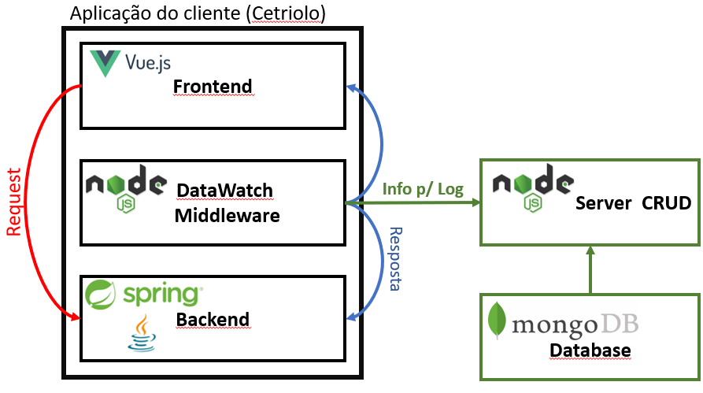

## Tópicos Avançados em Banco de Dados

### Inicializar download de dependências
```
npm install
```

#### Executar aplicação ambiente local de desenvolvimento
```
npm run dev 
```
### Integrantes:
  
Scrum Master:  
  [André Pires](https://www.linkedin.com/in/andr%C3%A9-pires-87558919b/)
    
P.O:  
  [Wesley Vinicius Silva](https://www.linkedin.com/in/wesley-vinicius-silva-8568a516b/)
    
Dev Team:  
  [Ana Carolina Simplicio de Moura](https://www.linkedin.com/in/ana-carolina-simplicio-de-moura-84bb49148/)  
  [André Ricardo de Souza](https://www.linkedin.com/in/andr%C3%A9-ricardo-souza-e-silva/)
  [Gabriel Pereira Bastos](https://www.linkedin.com/in/gabriel-pereira-bastos/)  
  [Maria Clara Oliveira](https://www.linkedin.com/in/oliveira-mclaraa/)  
  [Railson Tales de Oliveira](https://www.linkedin.com/in/railson-tales/)  
  [Rone Felipe Bento](https://www.linkedin.com/in/ronefellipebento/)

- Objetivo
  
  - Resolver o problema de monitoramento e geração de evidência dos dados que é garantido pela lei da LGPD, para que caso algum dado precise ser verificado, de quando ele foi compartilhado, acessado ou modificado, isso esteja guardado para uma possivel auditoria.

- Solução e introdução do projeto

  - A aplicação é um gerador de evidencia para a utilização de dados sensíveis e pessoais.
  - A aplicação é um middleware que ficara encarregado de interceptar as requests de um software e gerar um log dos dados sensíveis e pessoais que estão presentes nessa request.
  - O DataWatch irá logar todas as informações relevantes como quem teve acesso a esse dado e quando. Os dados ficarão criptografados em nosso banco de dados para que garanta a privacidade dos dados.
  
  
  
### Cronograma de entregas

- [x] **Sprint 1** - Server CRUD e Banco de Dados (28/03/2021)
- [ ] **Sprint 2** - Middleware (18/04/2021)
- [ ] **Sprint 3** - Segurança e Integridade (16/05/2021)

-------------


### Primeira entrega - Server CRUD e Banco de Dados. (28/03/2021)

- Server CRUD configurado inicialmente para processar um arquivo .JSON simulando uma requisição da aplicação do cliente.
- Banco de Dados MongoDB configurado para receber o registro gerado pelo Server CRUD.
- Relatório .CSV dos registros processados e armazenados no MongoDB pelo Server CRUD.
  
Vídeo de apresentação da primeira sprint: https://www.youtube.com/watch?v=GvKmITOH9ao
  
### Segunda entrega - Middleware. (18/04/2021)
  
Nesta sprint entregaremos o Middleware que irá interceptar requisições na aplicação do cliente. Tais requisições serão enviadas para o Server CRUD, que irá alimentar nosso banco de dados, de onde serão extraídos os relatórios de acesso a dados pessoais e pessoais sensíveis.
  
### Terceira entrega - Segurança e Integridade (16/05/2021)
  
Nesta sprint aplicaremos requisitos de segurança e integridade, utilizando assinatura digital e criptografia, garantindo maior proteção no trafego das requisições do Middleware para o Server CRUD.
